# Лабораторная работа №3. Облачные сети

## Описание лабораторной работы
В данной лабораторной работе изучается создание и настройка виртуальной сети в AWS, включая подсети, маршрутизацию, интернет-шлюз, NAT Gateway, Security Groups и EC2-инстансы. Особое внимание уделяется взаимодействию публичных и приватных ресурсов внутри VPC.

## Постановка задачи
Научиться вручную создавать виртуальную сеть (VPC) в AWS, добавлять подсети, таблицы маршрутов, интернет-шлюз (IGW) и NAT Gateway, а также настраивать взаимодействие между веб-сервером в публичной подсети и сервером базы данных в приватной.

## Цель и основные этапы работы
- Освоить изоляцию сетей в AWS (VPC)
- Научиться создавать и связывать компоненты сети
- Понять взаимодействие EC2-инстансов разных подсетей
- Различать публичные и приватные маршруты

## Практическая часть

### Шаг 1. Подготовка среды
Входим в AWS Management Console. Регион установлен на Frankfurt (eu-central-1).  

### Шаг 2. Создание VPC
Создана VPC с параметрами:  
- Name tag: `student-vpc-k9`  
- IPv4 CIDR block: `10.9.0.0/16`  
- Tenancy: Default  

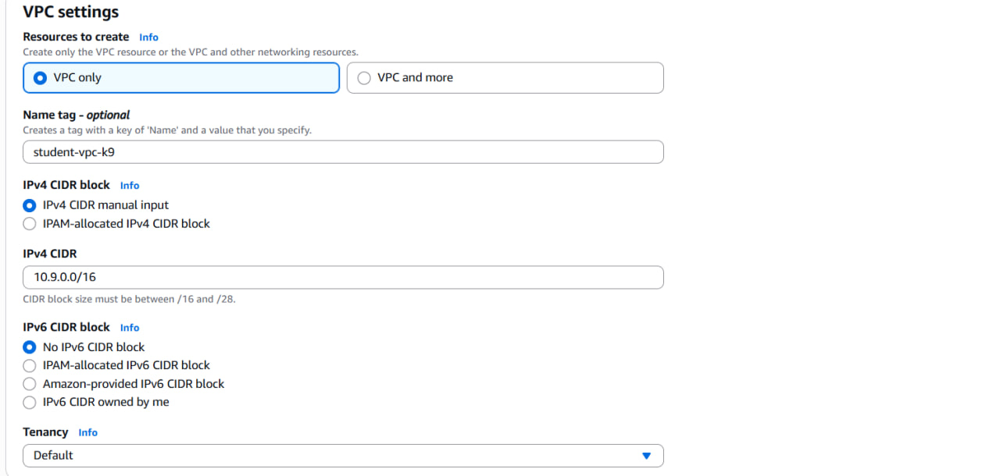

### Шаг 3. Создание Internet Gateway (IGW)
- Name tag: `student-igw-k9`  
- Прикреплен к `student-vpc-k9`

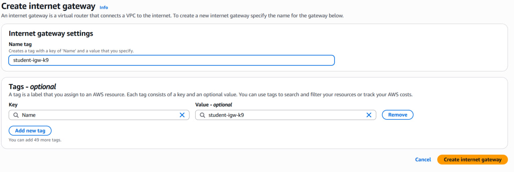
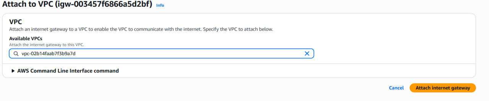

### Шаг 4. Создание подсетей

#### 4.1. Публичная подсеть
- Subnet name: `public-subnet-k9`  
- Availability Zone: `eu-central-1a`  
- IPv4 CIDR block: `10.9.1.0/24`  

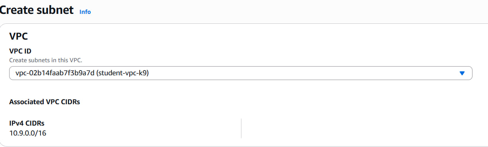
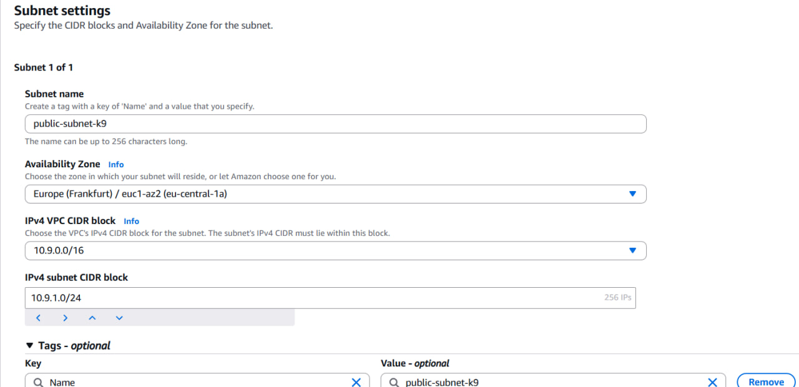

#### 4.2. Приватная подсеть
- Subnet name: `private-subnet-k9`  
- Availability Zone: `eu-central-1b`  
- IPv4 CIDR block: `10.9.2.0/24`  

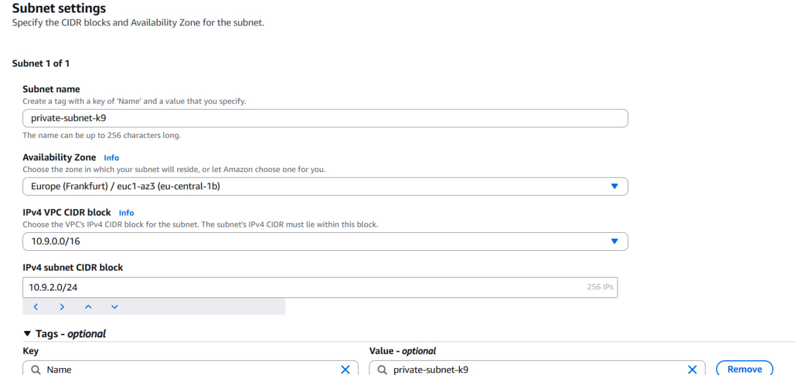

### Шаг 5. Создание таблиц маршрутов

#### 5.1. Публичная таблица маршрутов
- Name tag: `public-rt-k9`  
- Route: `0.0.0.0/0 → IGW`  
- Привязка к `public-subnet-k9`  

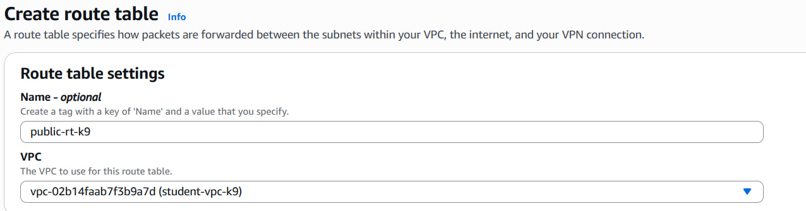
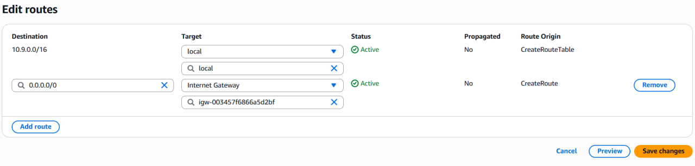

#### 5.2. Приватная таблица маршрутов
- Name tag: `private-rt-k9`  
- Привязка к `private-subnet-k9`  
- Пока доступа в интернет нет (без NAT Gateway)  

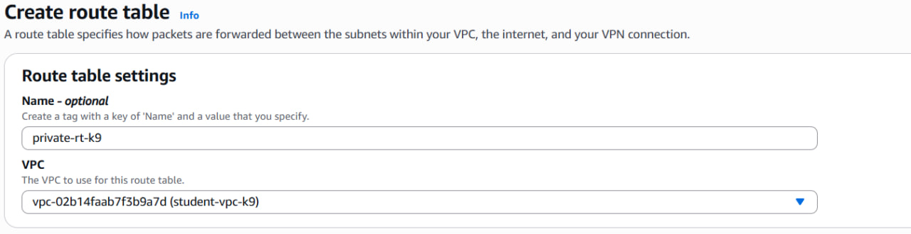
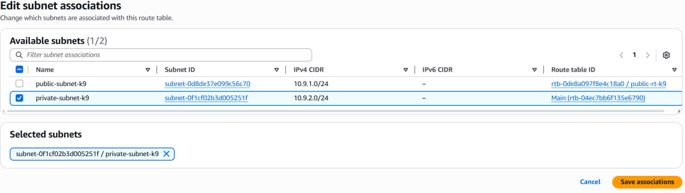

### Шаг 6. Создание NAT Gateway

#### 6.1. Elastic IP
Выделен статический адрес для NAT Gateway  

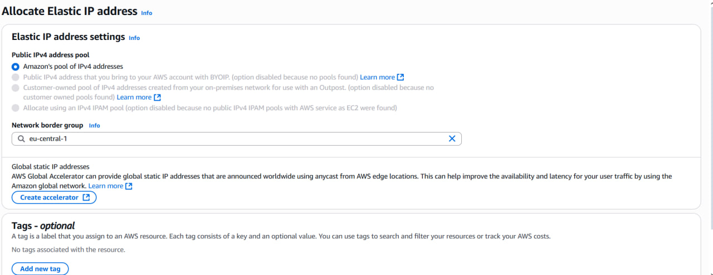

#### 6.2. NAT Gateway
- Name tag: `nat-gateway-k9`  
- Subnet: `public-subnet-k9`  
- Elastic IP назначен  

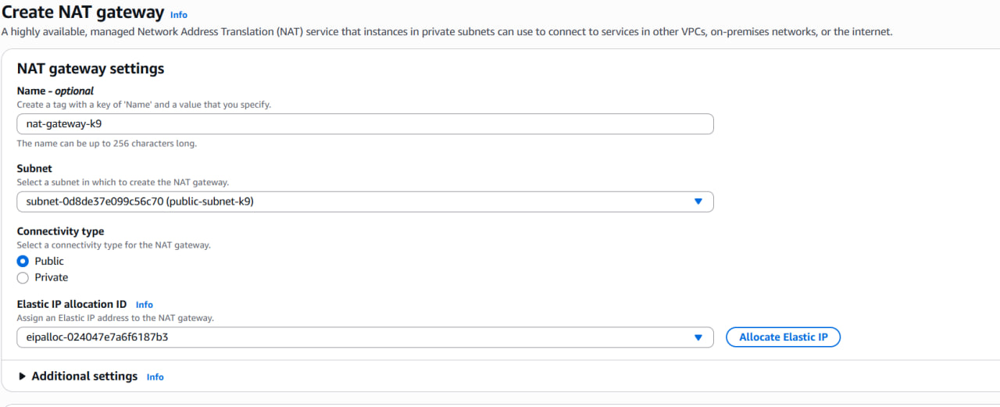

#### 6.3. Изменение приватной таблицы маршрутов
Добавлен маршрут `0.0.0.0/0 → NAT Gateway`, теперь приватная подсеть имеет доступ в интернет через NAT  

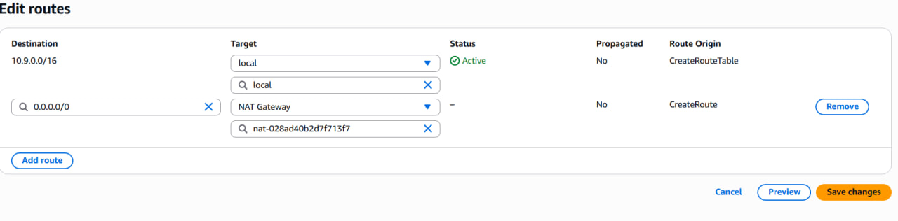

### Шаг 7. Создание Security Groups
- `web-sg-k9`: разрешен HTTP/HTTPS с любого адреса  
- `bastion-sg-k9`: разрешен SSH только с моего IP  
- `db-sg-k9`: разрешен MySQL только с веб-сервера, SSH только с bastion-host  

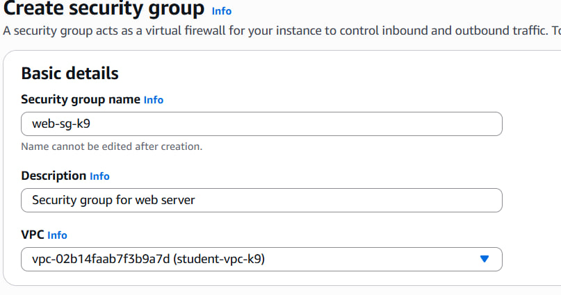
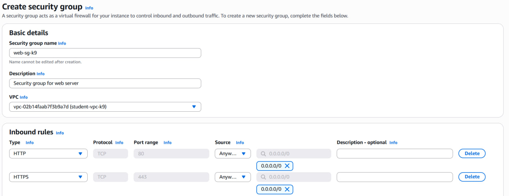
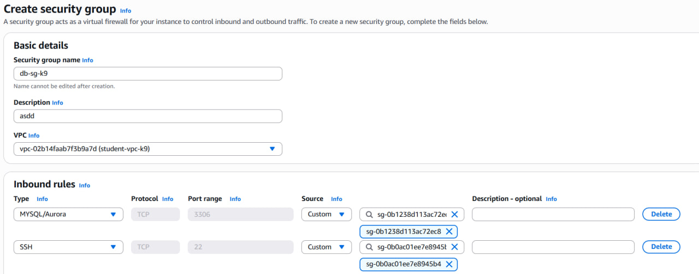

### Шаг 8. Создание EC2-инстансов
- `web-server` в публичной подсети с HTTP/HTTPS  
- `db-server` в приватной подсети с MySQL  
- `bastion-host` в публичной подсети с SSH и клиентом MySQL  

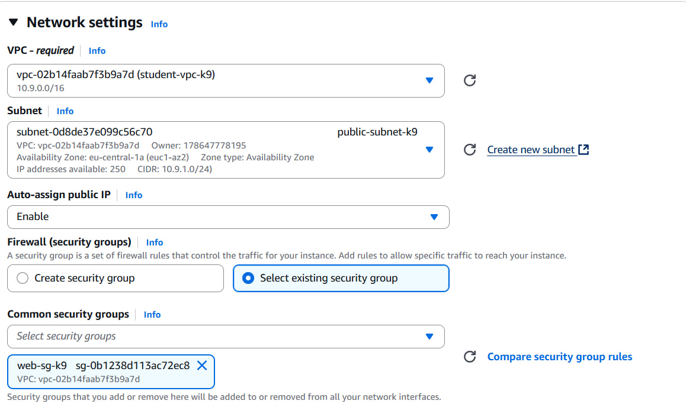
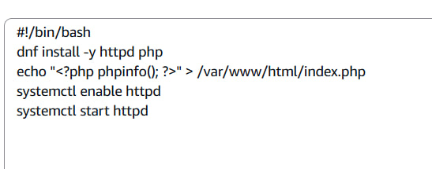
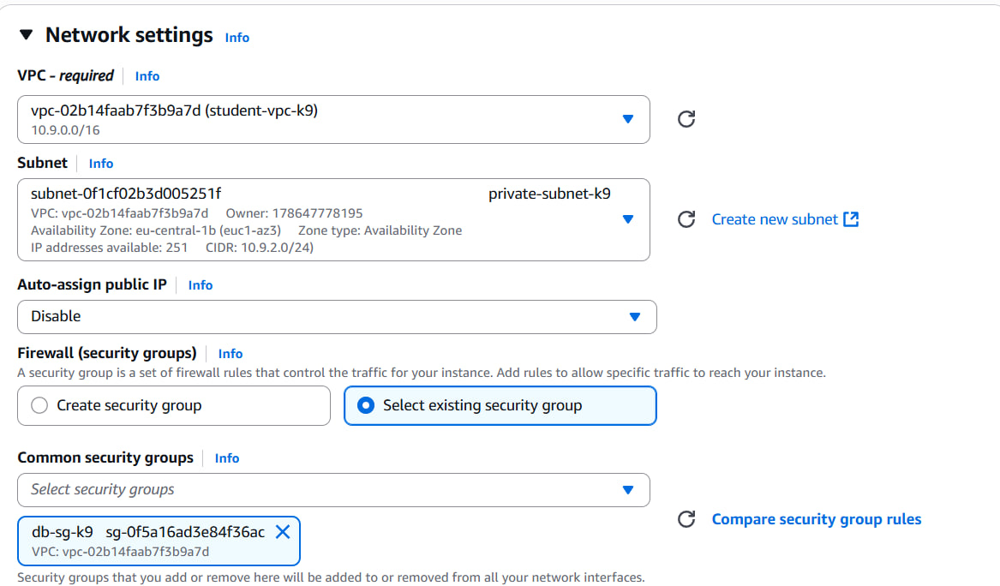
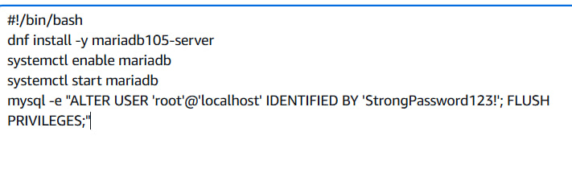
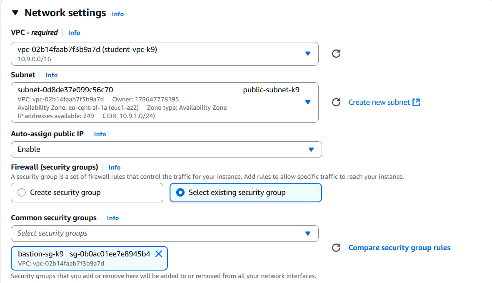
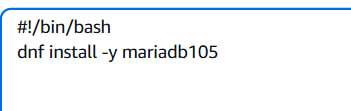

### Шаг 9. Проверка работы
- Веб-сервер доступен по публичному IP  
- Bastion-host успешно пингует интернет  

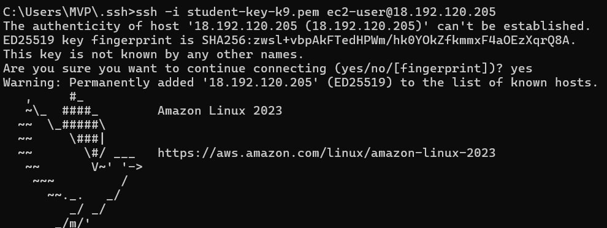
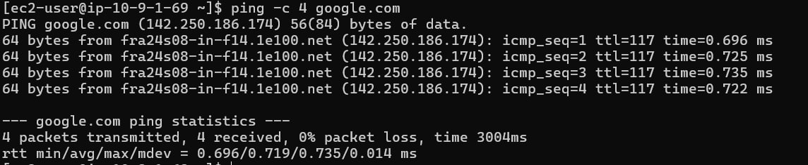

## Вывод

В ходе лабораторной работы изучена настройка виртуальной сети (VPC) в AWS, включая создание подсетей, интернет-шлюза (IGW), NAT Gateway, таблиц маршрутов и Security Groups. Созданы три EC2-инстанса: веб-сервер в публичной подсети, сервер базы данных в приватной подсети и bastion-host для безопасного доступа к приватным ресурсам. Проверено, что публичная подсеть имеет прямой доступ в интернет через IGW, а приватная подсеть может выходить в интернет только через NAT Gateway. Работа позволила понять принципы изоляции сетей, маршрутизации трафика между подсетями, создание и связывание ключевых компонентов сети, а также обеспечение безопасного взаимодействия ресурсов внутри VPC.

## Контрольные вопросы

1. **Что обозначает маска `/16`? Почему нельзя использовать, например, `/8`?**  
Маска `/16` означает, что первые 16 бит IP-адреса фиксированы и задают сеть, а оставшиеся 16 бит используются для адресации подсетей и хостов внутри VPC. Использовать `/8` нельзя, так как это слишком большой диапазон, который может конфликтовать с другими сетями и неэффективен для управления подсетями.

2. **Является ли подсеть публичной на этапе создания? Почему?**  
Нет, на этапе создания подсеть не является публичной, потому что она ещё не привязана к таблице маршрутов с Internet Gateway (IGW). Публичной подсеть делает именно наличие маршрута `0.0.0.0/0 → IGW`.

3. **Является ли подсеть приватной на этапе создания? Почему?**  
Подсеть не является полностью приватной сразу после создания, так как маршруты ещё не настроены. Она станет приватной, когда для неё используется таблица маршрутов без прямого выхода через IGW, а доступ в интернет обеспечивается только через NAT Gateway.

4. **Зачем необходимо привязать таблицу маршрутов к подсети?**  
Привязка таблицы маршрутов к подсети необходима, чтобы подсеть использовала заданные маршруты. Без привязки подсеть будет использовать основную таблицу маршрутов по умолчанию, что может не соответствовать задуманной архитектуре.

5. **Что такое Bastion Host и зачем он нужен в архитектуре с приватными подсетями?**  
Bastion Host — это промежуточный сервер, через который осуществляется безопасный доступ к ресурсам в приватной подсети. Он позволяет администратору подключаться к серверам базы данных или другим приватным ресурсам через SSH без прямого доступа из интернета.

6. **Что делают опции `-A` и `-J`?**  
- `-A` — включает **forwarding агента аутентификации**, то есть позволяет использовать ваш локальный SSH-ключ для подключения к конечному серверу через Bastion, без копирования ключа на bastion.  
- `-J` — указывает **jump host (промежуточный сервер)**, через который происходит подключение к целевому серверу. В данном случае Bastion-Host используется как промежуточная точка для доступа к DB-Server.

 

## Список использованных источников
* [Moodle](https://elearning.usm.md/mod/assign/view.php?id=316713)
* [ChatGPT](https://chatgpt.com/)
* [AWS](https://aws.amazon.com/ru/)

